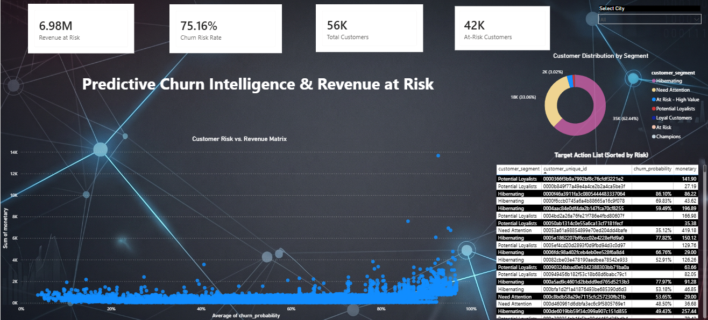

# 📊 E-Commerce Predictive Customer Churn Analytics

## 📝 Overview
This project is an advanced Data Analytics and Business Intelligence solution designed to predict and analyze customer churn for an e-commerce platform. By integrating predictive machine learning probabilities with transactional data, this Power BI dashboard provides actionable intelligence to marketing and retention teams.

The core objective is to move beyond historical reporting and proactively identify high-value customers who are at a high risk of leaving, thereby protecting the company's bottom line.

## 🎯 Key Business Metrics Identified
- **Total Customer Base:** 56,000+
- **Revenue at Risk:** $6.98M
- **At-Risk Customers:** 42,000+
- **Overall Churn Risk Rate:** 75.16%

## 🛠️ Tech Stack & Skills Highlighted
- **Business Intelligence:** Power BI
- **Data Modeling:** Star Schema Design (Fact & Dimension Tables, Bi-Directional Filtering)
- **Calculations:** Advanced DAX (Data Analysis Expressions) for dynamic KPIs
- **Data Analytics:** Customer Segmentation, Predictive Analytics Integration, Profitability Analysis

## 📈 Dashboard Features
1. **Customer Risk vs. Revenue Matrix:** An interactive scatter plot that instantly isolates "Danger Zone" customers (High monetary value + High churn probability).
2. **Dynamic KPI Cards:** Real-time calculation of total customers, churn rate, and total revenue at risk based on active filters.
3. **Target Action List:** A granular, exportable table sorted by churn probability, allowing marketing teams to immediately deploy targeted retention campaigns.
4. **Segment Distribution:** Donut chart breaking down the customer base into actionable segments (e.g., Champions, Hibernating, Potential Loyalists).

## 🧠 Technical Architecture (Data Modeling)
To ensure optimal performance and accurate cross-filtering, the data model was built using a strict **Star Schema**:
- **Fact Table:** `Customer_Transactions` (Center of the model handling all order data).
- **Dimension Tables:** `Customer_Segments` and `Customer_Churn_Predictions`.
- **Relationships:** 1-to-Many (*:1) relationships connecting unique customer IDs, utilizing bi-directional cross-filtering to allow seamless visual interactions without data duplication.

## 🚀 How to Use This Dashboard
1. Use the **City/Region Slicer** at the top right to filter the entire report for specific geographical insights.
2. Click on any segment within the **Donut Chart** to instantly see the revenue impact and specific customers within that category.
3. Export the **Target Action List** at the bottom right for email marketing or customer success interventions.
